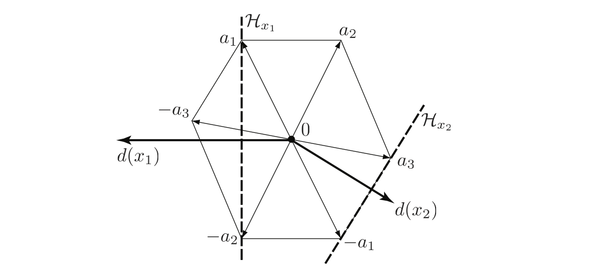

This Matlab package contains the source code to reproduce the figure of the article:

C. Dossal, G. Peyré, J. Fadili. [A Numerical Exploration of Compressed Sampling Recovery. Linear Algebra and Applications](https://hal.archives-ouvertes.fr/hal-00402455/), 432(7), pp. 1663–1679, 2010.

It is a greedy algorithm that allows one to estimate the restricted isometry of matrices.
In particular, it allows one to find sparsity level for which compressed sensing
conditions based on RIP does not holds.

Check test_challenging_rip.m for an example of how to use this algorithm.
Type 'help perform_greedy_deltas' for an explanation of the options and parameters of the algorithms.

Note that it can also be used to find sparse vector that are not recovered by
L1 minimization.

Copyright (c) 2009 Gabriel Peyre, Charles Dossal and Jalal Fadili
